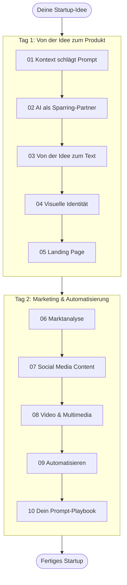

# KI Fundamental: Playbook

> Ein Hands-on-Kurs für Marketing-Fachleute. Zwei Abende, 10 Rezepte, ein fertiges Startup.

## Inhaltsverzeichnis

- [Konzept](#konzept)
- [Kursablauf](#kursablauf)
- [Loslegen](#loslegen)
- [Tools](#tools)
- [Design-Prinzipien](#design-prinzipien)
- [Lizenz](#lizenz)

---

## Konzept

Du simulierst die Gründung eines Startups über zwei Abende. Jedes AI-Tool wird eingeführt, weil dein Startup es braucht. Am Ende hast du ein konkretes Produkt mit Landing Page, Visuals und Go-to-Market-Plan.

## Kursablauf

### Tag 1: Von der Idee zum Produkt

| Block | Thema | Rezepte |
|-------|-------|---------|
| 1 | Ankommen und Entdecken | [01 Kontext schlägt Prompt](rezepte/01-kontext-schlaegt-prompt.md) |
| 2 | Idee und Texte | [02 AI als Sparring-Partner](rezepte/02-ai-als-sparring-partner.md), [03 Von der Idee zum Text](rezepte/03-von-der-idee-zum-text.md) |
| 3 | Bauen | [04 Visuelle Identität](rezepte/04-visuelle-identitaet.md), [05 Landing Page](rezepte/05-landing-page.md) |

### Tag 2: Marketing und Automatisierung

| Block | Thema | Rezepte |
|-------|-------|---------|
| 1 | Review und Vertiefung | [06 Marktanalyse](rezepte/06-marktanalyse.md) |
| 2 | Marketing-Maschine | [07 Social Media Content](rezepte/07-social-media-content.md), [08 Video und Multimedia](rezepte/08-video-und-multimedia.md) |
| 3 | Automatisieren und Abschluss | [09 Automatisieren](rezepte/09-automatisieren.md), [10 Dein Prompt-Playbook](rezepte/10-prompt-playbook.md) |

## Loslegen

> [!IMPORTANT]
> Alle Tools sind kostenlos und brauchen nur eine Email-Registrierung. Du richtest alles während des Kurses ein.

1. **[Setup: Tools und Registrierung](setup/)** aufrufen und Accounts anlegen
2. **[Prompt-Sammlung](prompts/)** als Referenz nutzen

### Quick Reference

| Ich will... | Geh zu... |
|-------------|-----------|
| Accounts einrichten | [Setup: Registrierung](setup/registrierung.md) |
| Einen Prompt kopieren | [Prompt-Sammlung](prompts/) |
| Das erste Rezept starten | [Rezept 01: Kontext schlägt Prompt](rezepte/01-kontext-schlaegt-prompt.md) |
| Tool-Details nachschlagen | [Tools: Übersicht](setup/tools.md) |

## Tools

4 Kerntools + 3 Video-Optionen, alle kostenlos:

| Tool | Wofür |
|------|-------|
| [Claude Free](https://claude.ai) | Chat, Prompting, Texte, Analyse |
| [Canva Free](https://canva.com) | Design, Social Media, Präsentationen |
| [Kling AI](https://klingai.com) / [Hailuo](https://hailuoai.video) / [Haiper](https://haiper.ai) | Videogenerierung (du wählst) |
| [Replit](https://replit.com) | Landing Page bauen |

Details: [setup/tools.md](setup/tools.md)

## Design-Prinzipien

- Jedes Rezept wird sofort angewendet. Keine Demo ohne Hands-on.
- Das Startup ist der rote Faden. Tools kommen, wenn dein Startup sie braucht.
- Kontext vor Technik. Guter Kontext schlägt jede Prompt-Formel.
- Rezepte statt Theorie. Gerade genug "Warum", dann "Wie" und "Mach".
- Das Prompt-Playbook ist dein Takeaway. Etwas, das du im Arbeitsalltag tatsächlich nutzt.
- Ehrlich über Grenzen. Baut Vertrauen und setzt realistische Erwartungen.

## Lizenz

Dieses Material steht unter der [CC BY-SA 4.0](https://creativecommons.org/licenses/by-sa/4.0/) Lizenz.

Ein Kurs von [Innoveto](https://innoveto.com).
